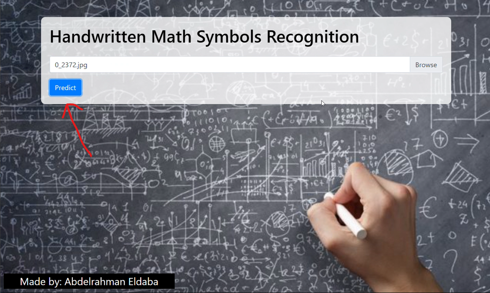

# Handwritten Math Symbols Recognition
This repository contains the code and resources for a project focused on recognizing some handwritten math symbols. The project includes data exploration, model training, and the development of a web application.

## Key Features:
- Dataset Exploration: Visualize the distribution of images across symbol categories.
- Model Training: Train a Convolutional Neural Network (CNN) using TensorFlow and Keras.
- Web Application: Develop a Flask-based web application for real-time symbol recognition.

## Demo:

